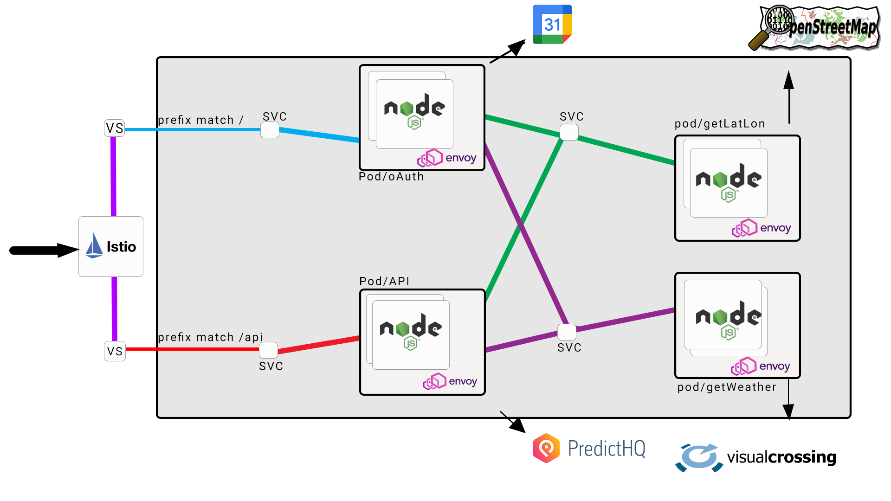

# Project-frsco


## Scopo del progetto

__Project-frsco__ è una web application che gira in un cluster Kubernetes mediante implementazione di microservizi, che si occupa di __associare ad un determinato evento le sue previsioni meteo__. Attraverso la funzionalità principale, __Project-frsco__ si collega al google calendar dell'utente attraverso l'uso di protocollo oAuth e elabora gli eventi della successiva settimana analizzandone la posizione (mediante uso di API __OpenStreetMap__) al fine di valutarne le condizioni meteo (mediante uso di API __VisualCrossing__ nella sua diramazione weather). L'interfaccia grafica, implementata mediante view .pug, mostra dunque all'utente una versione semplificata del proprio __google calendar__ stilizzando le caratteristiche meteo mediante l'uso di icone di facile interpretazione e provvedendo un sunto dell'evento. Inoltre le singole attività  (provviste di una __locazione valida__) possono essere arricchite di dettaglio attraverso un semplice click sulla interfaccia di evento fornita all'utente (o anche tramite URL). Ovviamente suddetto comportamento non sussiste in presenza di locazioni non identificabili per mezzo delle __API pubbliche di terzi utilizzate__.

Inoltre il servizio fornisce una serie di __API Pubbliche__ sempre in ottica realizzazione di una app a valore aggiunto, mediante l'utilizzo delle seguenti __API__:
 
 1. __La sopra citata OpenStreetMap__: al fine di ricavare data una posizione, le sue coordinate;
 2. __PredictHQ__: al fine di ricavare data una serie di coordinate, un insieme di eventi raggruppati nelle vicinanze della posizione richiesta(per maggiori dettagli usufruire delle API fornite);
 3. __La sopra citata VisualCrossing__; al fine di ricavare le previsioni meteo al dettaglio, fornite le coordinate.
 
---

## Architettura di riferimento



---

## Requisti soddisfatti 

1. __Il servizio REST che implementate (lo chiameremo SERV) deve offrire a terze parti delle API documentate.__ (requisito 1)
    - La nostra webapp offre [API](), in particolare è possibile:
        1. ottenere da una locazione ed una data una serie di eventi arricchiti di informazioni sul meteo caratteristico dei precedenti.
        2. arrichire il punto 1 di una possibile maxtemp e/o mintemp da soddisfare.
        3. selezionare una determinata categoria di eventi a scelta tra sport/concerts/community.

2. __SERV si deve interfacciare con almeno due servizi REST di terze parti (e.g. google maps).__ (requisiti 2, 3, 4)
    - La nostra webapp utilizza le seguenti API esterne:
        1. Google Calendar: OAuth;
        2. OpenStreetMap;
        3. VisualCrossing;
        4. PredictHQ;


3. __Il progetto deve prevedere l'uso di Docker e l'automazione del processo di lancio, configurazione e test.__ (requisito 6)
    - La nostra webapp utilizza Docker:
        - Ogni immagine dei pod costituenti i services di kubernetes viene costruita tramite l'utilizzo di un Dockerfile e successivamente pushata su DockerHub
        - La creazione dei pod/deployment/services/virtualservices/gateway  automatizzati tramite utilizzo di file yaml di kubernetes nello specifico: underdefresco.yaml .

4. __Deve essere implementata una forma di CI/CD per esempio con le Github Actions__ (requisito 8)
    - La nostra webapp implenta Github Actions per:
        - Creazione e push su repository docker hub delle immagini relative;
        - Successivo pull su macchina google su self-hosted runner.
6. __Requisiti minimi di sicurezza devono essere considerati e documentati. Self-signed certificate sono più che sufficienti per gli scopi del progetto.__ (requisito 9)
    - La nostra webapp accetta solo richieste https autorizzate tramite l'utilizzo di Self-signed certificate.

---

## Installazione

- Sono necessari:
    - VM (Ubuntu)
    - docker;
    - k3s;
    - istio;
    

- Eseguire un `git clone` del repository:

```
git clone https://github.com/gianbus/rc-project
```

e posizionarsi nella root directory del git.


- Creare una applicazione su [Google Cloud Platformm](https://console.cloud.google.com), inserire tra i callback uri `http://<host>:<port>/`  ed inserire tra i servizi abilitati Google Calendar API.
- Creare un account su [Visual Crossing](https://www.visualcrossing.com/weather-api) per ottenere la key che dà accesso alle API.
- Creare un account su [PredictHQ](https://www.predicthq.com/apis) per ottenere la key che dà accesso alle API.


### Configurare l'ambiente kubernetes/istio su VM

Scarichiamo la lista aggiornata dei pacchetti e delle nuove versioni disponibili nei repository
```
sudo apt update
```
Installiamo docker
```
sudo apt install docker.io
```

Installiamo k3s disattivando traefik
```
curl -sfL https://get.k3s.io | sh -s - --no-deploy=traefik --write-kubeconfig-mode 644
```

Installiamo istio e settiamo le variabili d'ambiente necessarie per l'utilizzo di istioctl
```
curl -L https://istio.io/downloadIstio | ISTIO_VERSION=1.14.1 TARGET_ARCH=x86_64 sh -
cd istio-1.14.1
export PATH=$PWD/bin:$PATH
export KUBECONFIG=/etc/rancher/k3s/k3s.yaml
istioctl install --set profile=demo -y
```

Abilitiamo l'istio-injection degli envoy proxy nei pod appartenenti al namespace di default
```
kubectl label namespace default istio-injection=enabled
```
Adesso risulta configurato correttamente l'ambiente k3s e istio.

### Creare il secret contenente le API keys
Prima di applicare il deployment dell'applicazione __Project-frsco__ vero e proprio, viene configurato il secret contenente tutte le API keys necessarie al funzionamento dell'applicazione e i certificati SSL.

1. Creiamo il file underdefresco_key.yaml con la seguente struttura
```
apiVersion: v1
kind: Secret
metadata:
  name: mysecret
type: Opaque
stringData:
  CLIENT_ID: "XXXXXXXXXXXXXXXXXXXXXXXXXXXXXXXXXXXXXXXXXXXXXXX"
  CLIENT_SECRET: "XXXXXXXXXXXXXXXXXXXXXXXXXXXXXXXXXXXXXXXXXXX"
  REDIRECT_URIS: "XXXXXXXXXXXXXXXXXXXXXXXXXXXXXXXXXXXXXXXXXXX"
  VISUAL_WEATHER_KEY: "XXXXXXXXXXXXXXXXXXXXXXXXXXXXXXXXXXXXXX"
  PREDICT_KEY: "XXXXXXXXXXXXXXXXXXXXXXXXXXXXXXXXXXXXXXXXXXXXX"
```
2. Eseguiamo l'apply del secret con il comando:
```
kubectl apply -f underdefresco_key.yaml
```
Adesso risulta correttamente creato il secret contenente le api keys.

### Creare il certificato SSL e il secret associato
Al fine di garantire la connessione https creiamo un certificato self-signed.
1. Creiamo le chiavi relative alla Certification Authority
```
openssl req -x509 -sha256 -nodes -days 365 -newkey rsa:2048 -subj '/O=CA Inc./CN=CA.com' -keyout CA.key -out CA.crt
```
2. Creiamo successivamente il certificato vero e proprio
```
openssl req -out {example.com}.csr -newkey rsa:2048 -nodes -keyout {example.com}.key -subj "/CN={your organisation name}/O={your organisation name}"
openssl x509 -req -sha256 -days 365 -CA CA.crt -CAkey CA.key -set_serial 0 -in {example.com}.csr -out {example.com}.crt
```
3. Creiamo ed applichiamo quindi il secret frescocredentials al namespace istio-system
```
kubectl create -n istio-system secret tls frescocredentials --key={example.com}.key --cert={example.com}.crt
```

### Deployment applicazione
Dopo aver opportunamente sostituito le voci {ip_VM} (nel file rc-project/kubernetes/deployment/underdefresco.yaml) con l'ip della vostra Virtual Machine, e quindi recatici nella stessa directory, per effettuare l'apply di tutti i Deployments, Services, VirtualServices e Gateways che compongono l'applicazione basta utilizzare il comando:
```
kubectl apply -f underdefresco.yml
```

### Analisi del traffico e installazione addons Jaeger e Kiali
Ai fini dell'analisi del traffico attraverso istio è consigliata l'installazione di ulteriori addons, in particolare Jaeger e Kiali.
L'installazione di questi ultimi è possibile attraverso il seguenti comando:
```
kubectl apply -f samples/addons
kubectl rollout status deployment/kiali -n istio-system
```
Successivamente per esporre i servizi in rete sono necessarie le applicazioni dei file kiali.yaml e jaeger.yaml contenuti nella cartella rc-poject/kubernetes/deployment/ e dopo aver sostituito opportunamente le voci {ip_VM} con l'IP esterno della vostra Macchina Virtuale.
Questo può essere effettuato, dopo essersi recati nella directory sopracitata, con i comandi:
```
kubectl apply -f kiali.yml
kubectl apply -f tracing.yml
```

